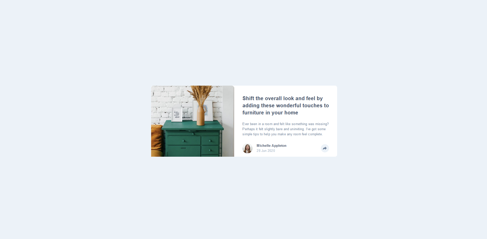
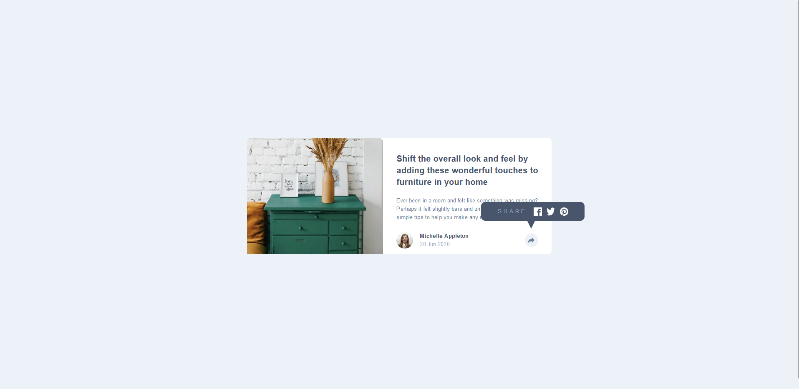
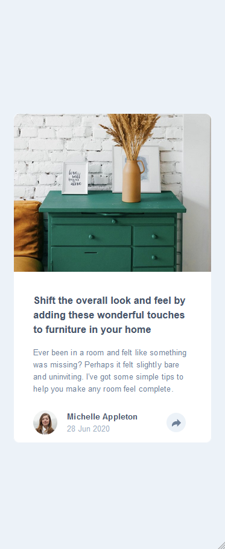
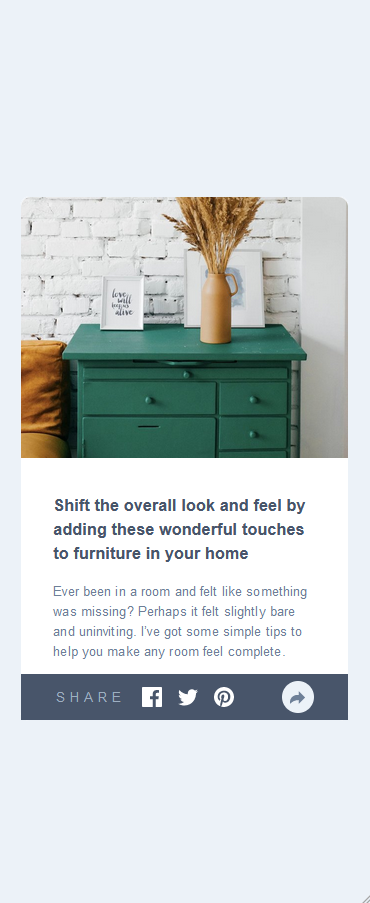

# Frontend Mentor - Article preview component solution

This is a solution to the [Article preview component challenge on Frontend Mentor](https://www.frontendmentor.io/challenges/article-preview-component-dYBN_pYFT). Frontend Mentor challenges help you improve your coding skills by building realistic projects.

## Table of contents

- [Overview](#overview)
  - [The challenge](#the-challenge)
  - [Screenshot](#screenshot)
  - [Links](#links)
- [My process](#my-process)
  - [Built with](#built-with)
  - [Useful resources](#useful-resources)
- [Author](#author)

## Overview

### The challenge

Users should be able to:

- View the optimal layout for the component depending on their device's screen size
- See the social media share links when they click the share icon

### Screenshot

### Links

- Solution URL: [GitHub repo](https://github.com/ivanorsolic95/article-preview-component)
- Live Site URL: [Check out my solution](https://article-component-my-solution.netlify.app/)

## My process

### Built with

- HTML5
- CSS custom properties
- Flexbox
- Mobile-first workflow
- JavaScript

### Useful resources

- [CSS Book](https://goalkicker.com/CSSBook/CSSNotesForProfessionals.pdf) - This book helped me to realize how to use CSS transform and translate properties.

## Author

- Website - [Ivan Orsolic](https://ivanorsolic.live/)
- Frontend Mentor - [ivanorsolic95](https://www.frontendmentor.io/profile/ivanorsolic95)
- Twitter - [orsolic_ivan1](https://x.com/orsolic_ivan1)
